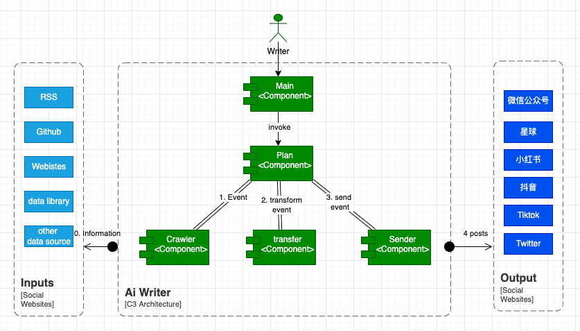

# AiWriter with ChatGPT

## AiWriter Plugin Architecture



* use `prompt` to record `AiWriter` pair developing logs
* use `resources` to save all templates and static files
* use `crawler` to spider and generate information `event`
* use `transfer` to transform `event` to another one
* use `sender` to send `event` to multiple platform
* user `plan` to schedule crawler, parser, sender for business flow

## Features

### done

* US1 - add sender-wechat open platform
* US2 - add crawler for https://gpt3demo.com/  [refactoring]
* US3 - add transfer-markdown [refactoring]
* US4 - add transfer-google translate [refactoring]
* US5 - add plan-gpt3demo_to_wechat
* US6 - add main python to invoke relate plan
* US7 - add sender - xinqiu community

### next

* USX - add more crawler and parser and sender support
* USY - add more plan support

## Run project locally

```shell
pip install -r requirements.txt

export wechat_appid="replace me"
export wechat_appid="replace me"

python main -plan gpt3demo_to_wechat
python main -plan gpt3demo_to_xinqiu
```

### Notices

* Gpt3demoToJsonSourcePlan.py: used for generate source json file, pls run this plan first
* SendPlantArticlePlan.py: used for sending plant articles
* SendWxArticleFromJsonSourcePlan.py: used for sending wx articles
* ClearWxArticlesPlan.py: used for delete wx article, only 10 articles
* currentLocation.json: used for controlling current crawl articles offset and limit

### transfer

* event schema

```text

[
    {
        "tag": "h1",
        "text": "ActiveChat.ai",
        "children": []
    },
    {
        "tag": "h2",
        "text": "GPT-3使客户服务代理人的生活更轻松",
        "children": []
    },
    {
        "tag": "section",
        "text": "",
        "children": [
            {
                "tag": "h2",
                "text": "关于Activechat.ai",
                "children": []
            }
         ]
     } 
]    
```


