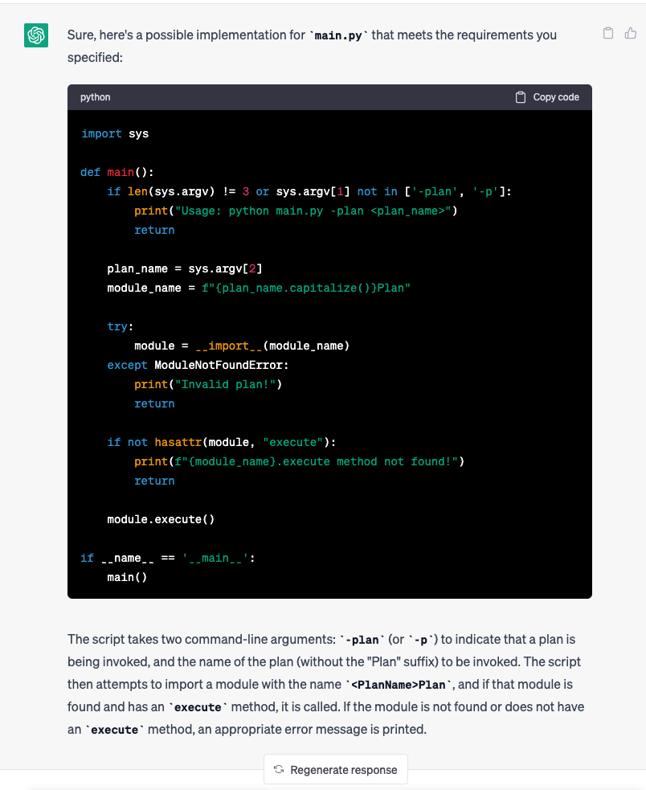

## pair with ChatGPT to build plan scheduler

```text
i want build a python script `main.py` help me manage commands and invoke related plan python.

User Story:  `US2`
Description:  as a writer, when i invoke `main.py` with parameter `-plan` or `-p`, then related Plan python file `<PlanName>Plan.py` will be invoked.
Acceptance Criteria:
    1. given `python main.py -plan gptdemo3_to_wechat`, then `Gpt3DemoToWechatPlan.py` class `execute` method will be invoked correctly.
    2. given `python main.py -plan not_existed`, then log and return `invalid plan!`

could you help implement `main.py` for me

```

### chatgpt response


