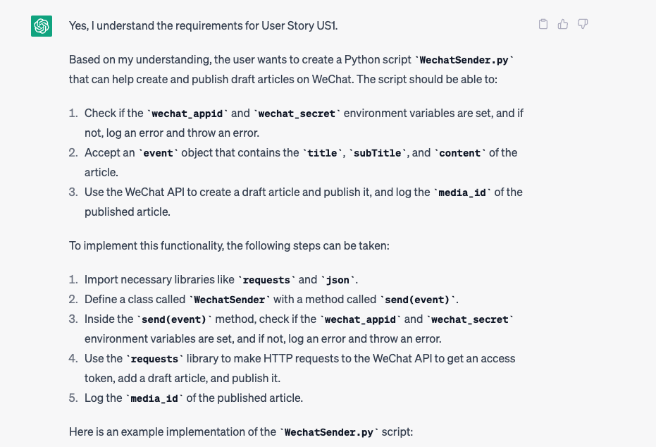
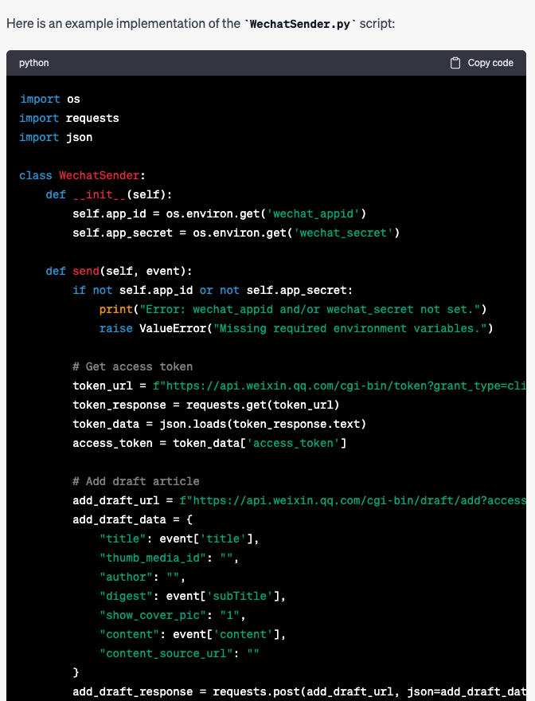
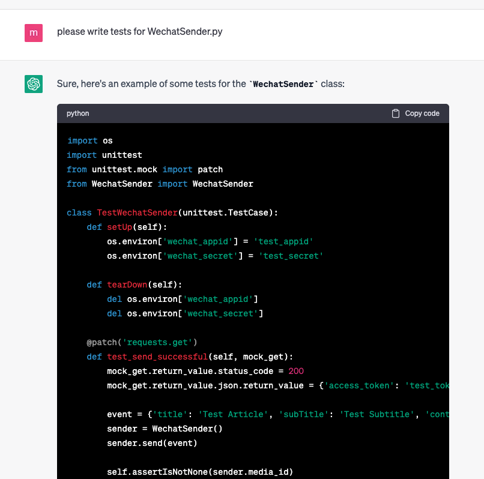
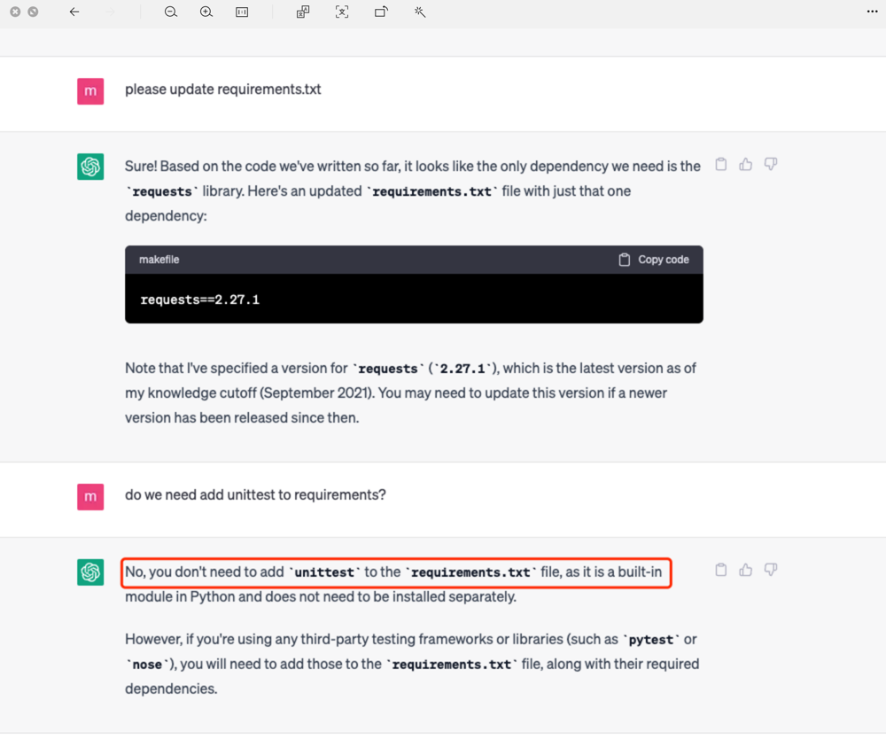
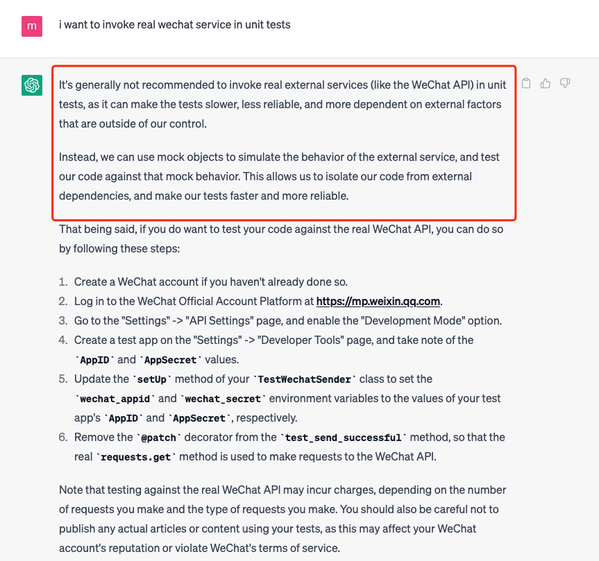
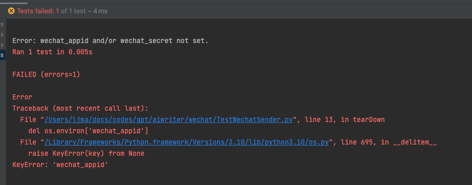
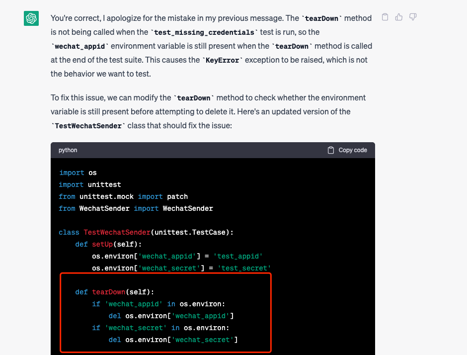
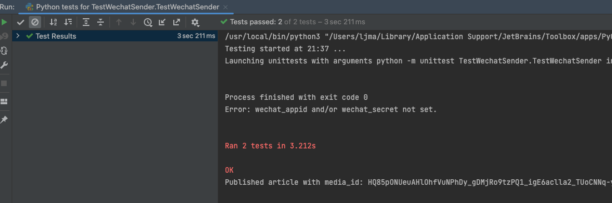
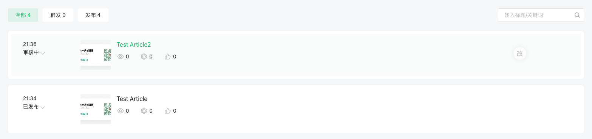

## initialize python file and raise requirements

i have one user story need your help.

User Story:  `US1`
description: i want create a python file "WechatSender.py", which can help me create wechat draft article and publish it.

Acceptance Criteria:
*  when system environment `wechat_appid` and `wechat_secret` is null, log error and throw error
*  when i invoke `WechatSender.send(event)`, a wechat draft article should been created and published
*  when i invoke `WechatSender.send(event)`, should log article id

tech solutions:
1. event contains `title`:String, `subTitle`:String, `content`:String
2. invoke wechat api steps should be
    * invoke `https://api.weixin.qq.com/cgi-bin/token` to get `access_token`
    * invoke `https://api.weixin.qq.com/cgi-bin/draft/add?access_token={{access_token}}` to add wechat draft article and get `media_id` from response
    * invoke `https://api.weixin.qq.com/cgi-bin/freepublish/submit?access_token={{access_token}}` to publish article by input `media_id`

if you understand above requirements please say yes.  secondly visualize your understanding about `US1` , last step implement "WechatSender.py" for me

### response from chatgpt

details file see /wechat/WechatSender.py

### write tests for WechatSender.py

details file see /wechat/TestWechatSender.py

### findings

* i was been taught

* chatgpt can fix failed test case

### final result

## Summarization

* chatgpt is good at single python file developing with clarified requirements.
* chatgpt know some best practices for example library imports and unit tests.
* chatgpt can complete almost 90% works. and left human can do 10% quick fix

so chatgpt can improve development efficiency.